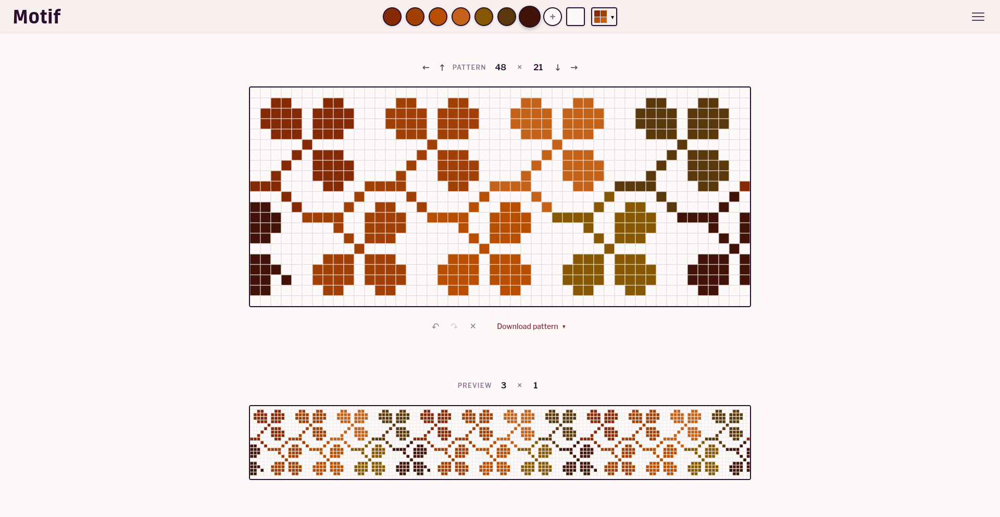

# Motif


Draw grid based patterns and see how they look when they repeat. Try Motif at [motif.works](https://motif.works).

## Features

- **Live tiled preview:** See customisable repeats as you draw
- **Flexible grid:** Create grids from 2×2 to 100×100 cells
- **Custom aspect ratios:** Square cells or custom dimensions for crafts like knitting
- **Multi-colour support:** Work with up to 20 colours per pattern
- **Export options:** Save your work as PNG, SVG, or JSON

## More information

See the [Help page](https://motif.works/help.html) and [About page](https://motif.works/about.html) to learn more about Motif.

<details>
<summary><strong>More Screenshots</strong> (click to expand)</summary>




</details>

## Technical Overview

Built with vanilla JavaScript, HTML, and CSS using a modular ES6 architecture. The codebase is organized into focused modules for configuration, utilities, state management, canvas rendering, and core business logic.

**Build system:** Vite for fast development and optimized production builds

**Testing:** Vitest for unit tests, Playwright for end-to-end testing

**Project structure:**
```
src/
├── config.js          # Configuration constants and UI constants
├── utils.js           # Utility functions
├── managers/          # Storage, history, and canvas management
├── core/              # Grid operations and export/import
├── ui/                # UI modules (handlers, menus, palette, etc.)
├── utils/             # Specialized utilities (validation, error handling)
└── main.js            # Application initialization
```

## Contributing

See [CONTRIBUTING.md](CONTRIBUTING.md) for development setup and guidelines.

**Branch strategy:** This project uses a two-branch workflow with `staging` for development and `main` for production. Create feature branches from `staging` and submit PRs to `staging` for integration. See [RELEASING.md](RELEASING.md) for details.

## License

MIT License - see [LICENSE](LICENSE) for details.

