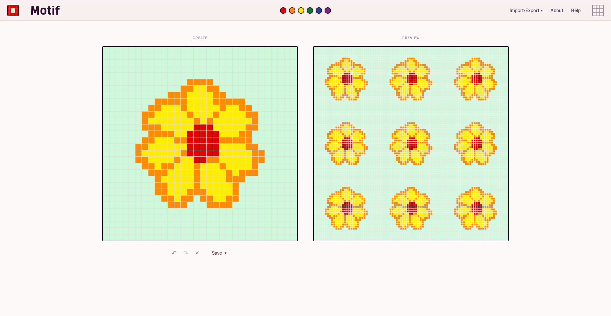

# Motif

**Design repeating patterns on a flexible grid with live preview.**



## Features

- **Live tiled preview:** See customisable repeats as you draw
- **Flexible grid:** Create grids from 2×2 to 100×100 cells
- **Custom aspect ratios:** Square cells or custom dimensions for crafts like knitting
- **Multi-colour support:** Work with up to 20 colours per pattern
- **Export options:** Save your work as PNG, SVG, or JSON

## Technical Overview

Built with vanilla JavaScript, HTML, and CSS using a modular ES6 architecture. The codebase is organized into focused modules for configuration, utilities, state management, canvas rendering, and core business logic.

**Build system:** Vite for fast development and optimized production builds

**Testing:** Vitest for unit tests, Playwright for end-to-end testing

**Project structure:**
```
src/
├── config.js          # Configuration constants
├── utils.js           # Utility functions
├── managers/          # Storage, history, and canvas management
├── core/              # Grid operations and export/import
└── main.js            # Application initialization
```

## Contributing

See [CONTRIBUTING.md](CONTRIBUTING.md) for development setup and guidelines.

## License

MIT License - see [LICENSE](LICENSE) for details.
